# Multi-Agent Financial Analysis System Architecture

## Comprehensive System Diagram

```mermaid
graph TB
    %% External Input
    User[👤 User Input<br/>CSV File + Stock Symbol]
    
    %% Main System Components
    subgraph "🏗️ Multi-Agent System Architecture"
        subgraph "🎯 Financial Analysis System"
            FAS[Financial Analysis System<br/>Main Orchestrator]
            
            subgraph "🤖 Specialized Agents with Names"
                FA[🧮 Wassim<br/>Fundamental Analyst<br/>AssistantAgent]
                SA[📊 Khizar<br/>Sentiment Analyst<br/>AssistantAgent]  
                VA[📈 Yugo<br/>Valuation Analyst<br/>AssistantAgent<br/>ARIMA Forecasting Leader]
            end
            
            subgraph "🧠 Agent Internal Structure"
                subgraph "Agent Components"
                    LLM[🧠 LLM<br/>Ollama Client<br/>llama3.2]
                    Profile[👤 Agent Profile<br/>Name & Description<br/>Specialized Expertise]
                    Memory[💾 Memory<br/>Chat History<br/>Context Management]
                    Tools[🔧 Tools<br/>AgentTool Wrapper<br/>Function Execution]
                    SystemMsg[📝 System Message<br/>Role Definition<br/>Expertise Instructions]
                end
                
                subgraph "Planning & Action"
                    Planning[📋 Planning<br/>Task Analysis<br/>Strategy Formulation]
                    Action[⚡ Action<br/>Stock Analysis<br/>Recommendation Generation]
                    SelfCorrection[🔄 Self-Correction<br/>Response Validation<br/>Error Handling]
                end
            end
        end
        
        subgraph "🗣️ Debate Orchestration"
            DO[Debate Orchestrator<br/>Consensus Management]
            Moderator[🎭 Debate Moderator<br/>AssistantAgent]
            
            subgraph "Debate Process"
                ConsensusCheck{🤝 Consensus<br/>Check}
                DebateRounds[💬 Debate Rounds<br/>Round-Robin Discussion]
                FinalDecision[🎯 Final Recommendation<br/>Majority Vote]
            end
        end
        
        subgraph "💾 Memory & State Management"
            ChatHistory[📚 Chat History<br/>Message Thread<br/>Conversation Context]
            AgentState[🔒 Agent State<br/>Persistent Context<br/>Between Interactions]
            AnalysisHistory[📊 Analysis History<br/>Past Recommendations<br/>Learning Data]
            ARIMAResults[📈 ARIMA Results<br/>Forecasting Data<br/>Time Series Analysis]
        end
        
        subgraph "🔄 Workflow Engine"
            TaskRouter[🎯 Task Router<br/>Agent Selection<br/>Workload Distribution]
            MessageBus[🚌 Message Bus<br/>Inter-Agent Communication<br/>Event Distribution]
            ResultAggregator[📋 Result Aggregator<br/>Response Collection<br/>Consensus Building]
        end
        
        subgraph "📊 CSV Data Processing"
            CSVLoader[📁 CSV Data Loader<br/>Historical Price Data<br/>Auto-Detection]
            ARIMAProcessor[🔮 ARIMA Processor<br/>Time Series Analysis<br/>Forecasting Engine]
            ForecastResults[📈 Forecast Results<br/>Price Predictions<br/>Confidence Intervals]
        end
    end
    
    %% Runtime Environment
    subgraph "⚙️ Runtime Environment"
        subgraph "🏃 Standalone Runtime"
            Runtime[Single-Threaded Runtime<br/>Local Process Execution]
            EventSystem[📡 Event System<br/>Message Passing<br/>State Management]
        end
        
        subgraph "🤖 AI Model Integration"
            OllamaClient[🦙 Ollama Client<br/>Local LLM Interface<br/>llama3.2 Model]
            ModelContext[🧠 Model Context<br/>Token Management<br/>Context Window]
        end
    end
    
    %% Data Flow Connections
    User --> FAS
    FAS --> CSVLoader
    CSVLoader --> ARIMAProcessor
    ARIMAProcessor --> ForecastResults
    ForecastResults --> VA
    FAS --> TaskRouter
    TaskRouter --> FA
    TaskRouter --> SA  
    TaskRouter --> VA
    
    %% Agent Internal Flow
    FA --> LLM
    SA --> LLM
    VA --> LLM
    
    FA --> Memory
    SA --> Memory
    VA --> Memory
    
    Memory --> ChatHistory
    Memory --> AgentState
    
    %% Analysis Flow
    FA --> Planning
    SA --> Planning
    VA --> Planning
    
    Planning --> Action
    Action --> SelfCorrection
    
    %% Results Flow
    FA --> ResultAggregator
    SA --> ResultAggregator
    VA --> ResultAggregator
    
    ResultAggregator --> ConsensusCheck
    
    %% Debate Flow
    ConsensusCheck -->|Disagreement| DO
    ConsensusCheck -->|Consensus| FinalDecision
    
    DO --> Moderator
    Moderator --> DebateRounds
    DebateRounds --> ConsensusCheck
    DebateRounds --> FinalDecision
    
    %% Memory Integration
    ChatHistory --> AnalysisHistory
    FinalDecision --> AnalysisHistory
    ForecastResults --> ARIMAResults
    ARIMAResults --> VA
    
    %% Runtime Integration
    FAS --> Runtime
    Runtime --> EventSystem
    EventSystem --> MessageBus
    MessageBus --> FA
    MessageBus --> SA
    MessageBus --> VA
    
    OllamaClient --> LLM
    LLM --> ModelContext
    
    %% Output
    FinalDecision --> User
    
    %% Styling
    classDef agentClass fill:#e1f5fe,stroke:#01579b,stroke-width:2px
    classDef systemClass fill:#f3e5f5,stroke:#4a148c,stroke-width:2px
    classDef memoryClass fill:#e8f5e8,stroke:#1b5e20,stroke-width:2px
    classDef runtimeClass fill:#fff3e0,stroke:#e65100,stroke-width:2px
    
    class FA,SA,VA,Moderator agentClass
    class FAS,DO,TaskRouter,MessageBus,ResultAggregator systemClass
    class Memory,ChatHistory,AgentState,AnalysisHistory,ARIMAResults memoryClass
    class Runtime,EventSystem,OllamaClient,ModelContext runtimeClass
    class CSVLoader,ARIMAProcessor,ForecastResults fill:#fff8e1,stroke:#f57c00,stroke-width:2px
```

## CSV Data Processing Workflow

```mermaid
sequenceDiagram
    participant U as 👤 User
    participant S as 🎯 System
    participant C as 📁 CSV Loader
    participant A as 🔮 ARIMA Processor
    participant F as 📈 Forecast Results
    participant Y as 📈 Yugo (Valuation Agent)
    
    U->>S: CSV File + Stock Symbol
    S->>C: Load Historical Data
    C->>C: Auto-detect Date/Value Columns
    C->>A: Pass Time Series Data
    A->>A: Check Stationarity
    A->>A: Find Optimal ARIMA Parameters
    A->>A: Fit ARIMA Model
    A->>F: Generate 30-Day Forecast
    F->>Y: Provide Forecasting Results
    Y->>S: Analysis with ARIMA Insights
    S->>U: Present Forecast & Analysis
```

## Multi-Agent Workflow with CSV/ARIMA Integration

```mermaid
sequenceDiagram
    participant U as 👤 User
    participant S as 🎯 System
    participant W as 🧮 Wassim (Fundamental)
    participant K as 📊 Khizar (Sentiment)
    participant Y as 📈 Yugo (Valuation)
    participant A as 🔮 ARIMA Results
    participant D as 🗣️ Debate Orchestrator
    participant M as 🎭 Moderator
    
    U->>S: CSV File + Stock Symbol
    S->>A: Process ARIMA Forecasting
    A->>Y: Provide Forecasting Results
    
    Note over S: Enhanced Prompt with ARIMA Data
    S->>W: Fundamental Analysis + ARIMA Context
    S->>K: Sentiment Analysis + ARIMA Context
    S->>Y: Valuation Analysis + ARIMA Insights
    
    par Parallel Analysis with ARIMA Context
        W->>W: Analyze Financials + Validate Forecasts
        and
        K->>K: Analyze Sentiment + Correlate with Trends
        and
        Y->>Y: Lead Analysis with ARIMA Results
    end
    
    W->>S: BUY/SELL + Fundamental Validation
    K->>S: BUY/SELL + Sentiment Context
    Y->>S: BUY/SELL + ARIMA Price Targets
    
    S->>S: Check Consensus
    
    alt Agents Agree
        S->>U: Consensus Recommendation
    else Agents Disagree
        S->>D: Initiate 2-Round Debate Process
        D->>M: Start Moderated Discussion
        
        loop 2 Rounds (6 Total Turns)
            M->>W: Request Position Defense
            M->>K: Request Position Defense  
            M->>Y: Request ARIMA-Based Defense
            W->>M: Defend/Refine Position
            K->>M: Defend/Refine Position
            Y->>M: Defend/Refine with ARIMA Data
            M->>D: Check for Consensus
        end
        
        D->>S: Final Recommendation
        S->>U: Debate-Based Recommendation
    end
```

## Agent Component Details

### Internal Agent Structure
Each agent (Wassim, Khizar, Yugo) contains:

1. **🧠 LLM Integration**
   - Ollama client connection (llama3.2 model)
   - Model context management
   - Token and context window handling

2. **👤 Agent Profile**
   - **Wassim**: "Wassim_Fundamental_Agent" - 15 years fundamental analysis experience
   - **Khizar**: "Khizar_Sentiment_Agent" - 12 years market sentiment expertise  
   - **Yugo**: "Yugo_Valuation_Agent" - 18 years quantitative analysis & ARIMA forecasting leader
   - Specialized system messages with personality and expertise
   - Descriptions for agent selection and debate coordination

3. **💾 Memory System**
   - Chat history maintenance with agent names
   - Context persistence between interactions
   - Analysis history for learning
   - ARIMA forecasting results storage (Yugo)

4. **📋 Planning & Action**
   - Task analysis and strategy formulation
   - CSV data integration and ARIMA context
   - Stock analysis execution with forecasting insights
   - Recommendation generation (BUY/SELL)
   - Self-correction and validation

5. **🔧 Tools Integration**
   - AgentTool wrapper for function execution
   - Tool call management
   - Result processing
   - ARIMA forecasting integration (Yugo)

### Workflow Design

#### CSV Data Processing Workflow:
1. **CSV Input**: User provides CSV file with historical price data
2. **Auto-Detection**: System detects date and value columns automatically
3. **Data Validation**: Check data quality and format
4. **Stationarity Check**: Test if time series is stationary
5. **ARIMA Processing**: Find optimal parameters and fit model
6. **Forecasting**: Generate 30-day price forecasts with confidence intervals
7. **Results Storage**: Store forecasting results for agent analysis

#### Multi-Agent Workflow with CSV/ARIMA Integration:
1. **CSV Processing**: Load and process historical data through ARIMA forecasting
2. **Enhanced Context**: ARIMA results are integrated into all agent prompts
3. **Parallel Analysis**: Agents work simultaneously with ARIMA context:
   - **Wassim**: Fundamental analysis + validates ARIMA forecasts against business metrics
   - **Khizar**: Sentiment analysis + correlates market psychology with forecasted trends
   - **Yugo**: Leads analysis with ARIMA insights + provides quantitative price targets
4. **Result Collection**: Gather all recommendations with ARIMA context
5. **Consensus Check**: Determine if agents agree on recommendation
6. **2-Round Debate Process** (if disagreement):
   - Initialize debate orchestrator with ARIMA context
   - Conduct 2 rounds (6 total turns) of structured discussion
   - Yugo leads with ARIMA-based arguments
   - Wassim and Khizar provide supporting analysis
   - Use moderator to facilitate evidence-based debate
7. **Final Decision**: Generate final recommendation through consensus or majority vote

### Memory & State Management

- **Chat History**: Maintains conversation thread between named agents (Wassim, Khizar, Yugo)
- **Agent State**: Persistent context for each agent between interactions
- **Analysis History**: Stores past recommendations for learning and reference
- **Debate History**: Records 2-round debate discussions and outcomes
- **ARIMA Results**: Stores forecasting data, model parameters, and price predictions

### Runtime Environment

- **Standalone Runtime**: Single-threaded local process execution
- **Event System**: Message passing and state management
- **Ollama Integration**: Local LLM processing with llama3.2 model
- **Model Context**: Token management and context window optimization

## Key Features of the Updated System

### 🎯 **CSV-First Workflow**
- **Primary Input**: CSV files with historical price data
- **Auto-Detection**: Automatically identifies date and value columns
- **Data Validation**: Ensures data quality before processing

### 📈 **ARIMA Forecasting Integration**
- **Yugo Leads**: Valuation agent with 18 years of quantitative analysis experience
- **Statistical Modeling**: Advanced time series analysis with optimal parameter selection
- **Price Predictions**: 30-day forecasts with confidence intervals
- **Trend Analysis**: Identifies patterns and volatility in historical data

### 🗣️ **Named Agent Personalities**
- **🧮 Wassim**: Fundamental analyst specializing in financial metrics and business validation
- **📊 Khizar**: Sentiment analyst focusing on market psychology and behavioral patterns  
- **📈 Yugo**: Valuation expert leading ARIMA analysis and quantitative insights

### 🤝 **Enhanced Debate System**
- **2-Round Structure**: 6 total turns (2 per agent) for efficient consensus building
- **ARIMA Context**: All discussions include forecasting insights and statistical validation
- **Evidence-Based**: Agents reference specific data points and forecasting results
- **Yugo Leadership**: Valuation agent leads discussions when ARIMA data is available

### 🔄 **Integrated Analysis Flow**
1. CSV data → ARIMA forecasting → Enhanced agent context
2. Parallel analysis with statistical insights
3. Consensus detection or structured debate
4. Final recommendation with quantitative backing

This architecture enables sophisticated financial analysis through specialized AI agents that integrate statistical forecasting with traditional analysis methods, collaborate through structured debates, and reach evidence-based consensus on investment recommendations.
